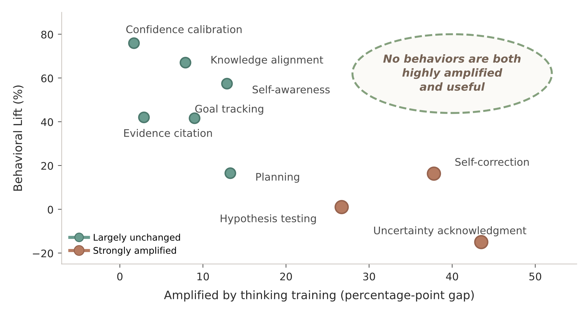

# Not All Thinking Helps: Which Reasoning Behaviors Predict Correctness?

**Jean de Dieu Nyandwi, Leena Mathur, Yonatan Bisk, Graham Neubig**

We study a simple question:

> Do reasoning-oriented "thinking" models amplify the behaviors that are actually associated with correct answers?

Our answer is **not always**. Thinking training makes traces look more deliberative, but the most amplified behaviors are not the ones most associated with correctness.

<p align="center">
  
</p>

The top-right quadrant is empty: no behavior is both strongly amplified by thinking training **and** strongly associated with correctness. Thinking models pour effort into self-correction, hypothesis testing, and uncertainty acknowledgment — visible deliberation. But the behaviors with the highest lift (confidence calibration, knowledge alignment, recognizing insufficient information) are quieter, and thinking training barely moves them.

## Behavioral Lift

We introduce **Behavioral Lift**, a metric that separates how common a behavior is from how useful it is:

$$\text{Lift}(b) = P(\text{correct} \mid b) - P(\text{correct} \mid \neg\, b)$$

A behavior has high lift when responses containing it are more likely to be correct than responses without it. High prevalence alone says nothing — a behavior can appear everywhere and predict nothing.

## Key Takeaways

**Amplification ≠ value.** Thinking training reliably amplifies correction and search behaviors (self-correction, hypothesis testing, uncertainty acknowledgment). But the highest-lift behaviors are different: confidence calibration, knowledge alignment, and self-awareness about missing information. The things models learn to do more of are not the things that matter most.

**Calibration is not hedging.** Confidence calibration is one of the strongest positive signals of correctness across both LLMs and VLMs. Uncertainty acknowledgment is heavily amplified but weakly — or negatively — associated with correctness. A model that says "maybe" at every step is not calibrated. Calibration means confidence tracks the strength of the reasoning.

**Thinking models often win through recovery, not avoidance.** Thinking models help most when tasks reward extended computation or recovery from intermediate mistakes. On pattern-matching tasks where the first pass tends to be right or wrong, instruct models can perform comparably or better.

## What Is In This Repo

```
prompts/          Annotation prompts for LLM and VLM traces
taxonomy/          Behavior and failure-mode definition and schemas
metrics/              Metric code for Behavioral Lift, Recovery Rate, and analysis
data/             Metadata and sample annotations
assets/           README figures
```

## Reproducing Results

```bash
pip install -r requirements.txt

# Behavioral Lift
python scripts/compute_behavioral_lift.py \
  --annotations data/annotations.jsonl \
  --out results/behavioral_lift.csv

# Recovery Rate
python scripts/compute_recovery_rate.py \
  --annotations data/annotations.jsonl \
  --out results/recovery_rate.csv

# Figures and tables
python scripts/make_figures.py --results results/ --out figures/
python scripts/make_tables.py --results results/ --out tables/
```

Full annotation files will be hosted on Hugging Face Datasets and linked here.

## Citation

```bibtex
@article{nyandwi2026notallthinking,
  title={Not All Thinking Helps: Which Reasoning Behaviors Predict Correctness?},
  author={Nyandwi, Jean de Dieu and Mathur, Leena and Bisk, Yonatan and Neubig, Graham},
  year={2026}
}
```
