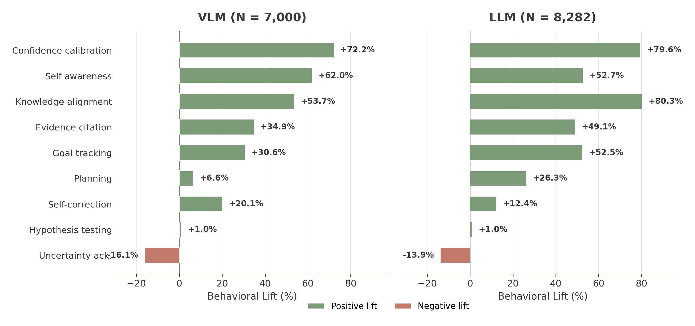

# Not All Thinking Helps: Which Reasoning Behaviors Predict Correctness?

**Jean de Dieu Nyandwi, Leena Mathur, Yonatan Bisk, Graham Neubig**

We study a simple question:

> Do reasoning-oriented "thinking" models amplify the behaviors that are actually associated with correct answers?

Our answer is **not always**. Thinking training makes traces look more deliberative, but the most amplified behaviors are not the ones most associated with correctness.

<p align="center">
  
</p>

The top-right quadrant is empty: no behavior is both strongly amplified by thinking training **and** strongly associated with correctness. Thinking models strongly amplify self-correction, hypothesis testing, and uncertainty acknowledgment — visible deliberation. But the behaviors with the highest lift, such as confidence calibration, knowledge alignment, and recognizing insufficient information, are quieter, and thinking training barely moves them.

## Behavioral Lift

We introduce **Behavioral Lift**, a metric that separates how common a behavior is from how much it is associated with correctness:

$$\text{Lift}(b) = P(\text{correct} \mid b) - P(\text{correct} \mid \neg b)$$

A behavior has high lift when responses containing it are more likely to be correct than responses without it. High prevalence alone says little: a behavior can appear everywhere and predict nothing.

<p align="center">
  
</p>

Behaviors differ sharply in how much they predict correctness. Confidence calibration, knowledge alignment, and self-awareness have high positive lift, while uncertainty acknowledgment is much weaker despite being strongly amplified by thinking training.

## Key Takeaways

**Amplification ≠ value.** Thinking training reliably amplifies correction, search, and uncertainty behaviors: self-correction, hypothesis testing, and uncertainty acknowledgment. But the highest-lift behaviors are different: confidence calibration, knowledge alignment, and self-awareness about missing information. The things models learn to do more of are not always the things that matter most.

**Calibration is not hedging.** Confidence calibration is one of the strongest positive signals of correctness across both LLMs and VLMs. Uncertainty acknowledgment is heavily amplified but weakly, or negatively, associated with correctness. A model that says "maybe" at every step is not calibrated. Calibration means confidence tracks the strength of the reasoning.

**Thinking models often win through recovery, not avoidance.** Thinking models help most when tasks reward extended computation or recovery from intermediate mistakes. On pattern-matching tasks where the first pass tends to be right or wrong, instruct models can perform comparably or better.

## Repository Structure

```text
prompts/        Annotation prompts for LLM and VLM traces
taxonomy/      Behavior definitions, failure modes, and JSON schemas
metrics/       Minimal code for Behavioral Lift and Recovery Rate
examples/      Small LLM/VLM sample annotation files
assets/        README figures
```

The full annotation dataset is available on Hugging Face: [neulab/behavioral-lift](https://huggingface.co/datasets/neulab/behavioral-lift)

```python
from datasets import load_dataset

ds = load_dataset("neulab/behavioral-lift")
llm = ds["llm"]   # 8,282 rows
vlm = ds["vlm"]   # 7,000 rows
```

## Running The Metric Scripts

Compute Behavioral Lift on the sample LLM annotations:

```bash
python3 metrics/behavioral_lift.py \
  examples/sample_llm_annotations.jsonl \
  --output results/sample_llm_behavioral_lift.csv
```

Compute Recovery Rate on the sample LLM annotations:

```bash
python3 metrics/recovery_rate.py \
  examples/sample_llm_annotations.jsonl \
  --output results/sample_llm_recovery_rate.csv
```

Run the same metrics on the VLM sample annotations:

```bash
python3 metrics/behavioral_lift.py \
  examples/sample_vlm_annotations.jsonl \
  --output results/sample_vlm_behavioral_lift.csv

python3 metrics/recovery_rate.py \
  examples/sample_vlm_annotations.jsonl \
  --output results/sample_vlm_recovery_rate.csv
```

You can group results by metadata fields such as `model`, `benchmark`, or `modality`:

```bash
python3 metrics/behavioral_lift.py \
  examples/sample_llm_annotations.jsonl \
  --output results/sample_llm_behavioral_lift_by_model.csv \
  --group-by model benchmark

python3 metrics/recovery_rate.py \
  examples/sample_vlm_annotations.jsonl \
  --output results/sample_vlm_recovery_by_model.csv \
  --group-by model benchmark
```

The metric scripts accept either a single JSONL file or a directory containing JSONL files.

## Citation

```bibtex
@article{nyandwi2026notallthinking,
  title={Not All Thinking Helps: Which Reasoning Behaviors Predict Correctness?},
  author={Nyandwi, Jean de Dieu and Mathur, Leena and Bisk, Yonatan and Neubig, Graham},
  year={2026}
}
```
